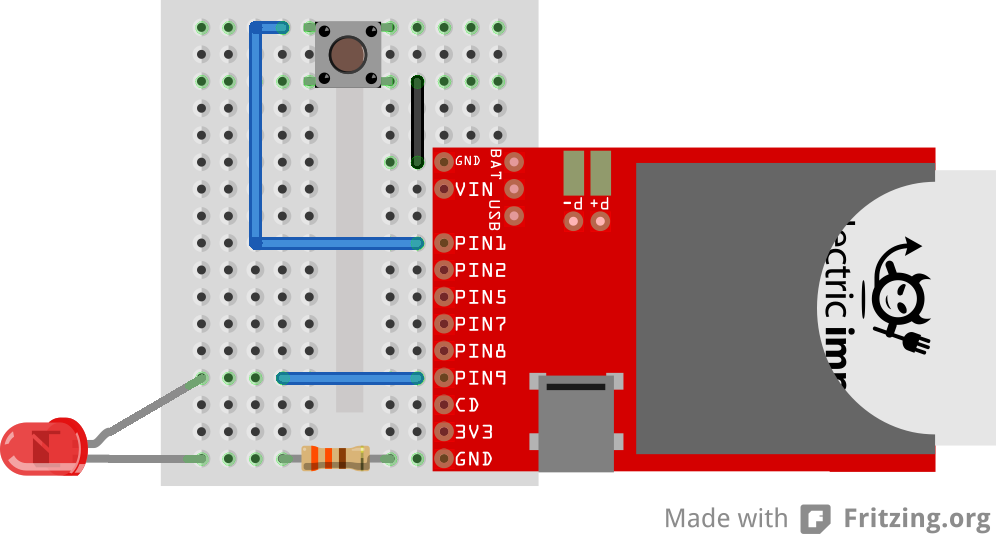

# HackBright2k15
Code and Slides for the Spring 2015 Hackbright Workshop

## Overview
This workshop contains three examples, two of which we will go over during the workshop itself - and one that we encourage you to try on your own afterwards:

- [Example 1 - Toggle](./toggle) - Learn how to control and LED and read a button
- [Example 2 - Twitter](./twitter) - Learn how to open a connection to the Twitter Streaming API and do things when a tracked search term is tweeted.
- [Example 3 - TempBug](www.instructables.com/id/TempBug-internet-connected-thermometer/) - Create an Internet-connected temperature sensor.

## Circuit
Examples 1 & 2 use the following circuit:

Example 3 uses a different circuit that is described in the Instructables.

# LICENSE
All of the material in this workshop is licensed under the [MIT License](./LICENSE)
